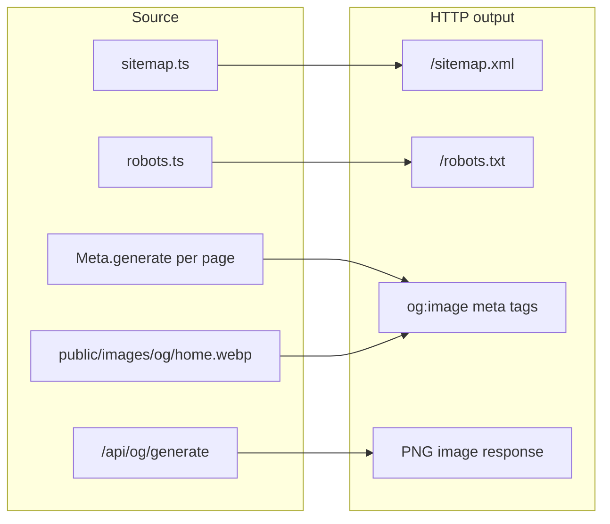

# Sitemap, robots.txt, and OG Images — Existence and Output Checks

## What exists in this project

| Asset | Source file | Served at | Type |
|-------|-------------|-----------|------|
| Sitemap | [`src/app/sitemap.ts`](src/app/sitemap.ts) | `/sitemap.xml` | Generated at runtime by Next.js |
| Robots | [`src/app/robots.ts`](src/app/robots.ts) | `/robots.txt` | Generated at runtime by Next.js |
| OG images | Mixed (see below) | Per-page meta tags + `/api/og/generate` | Static file + dynamic API |

There are **no** `public/sitemap.xml`, `public/robots.txt`, or `opengraph-image.png` files. Next.js generates the first two from `sitemap.ts` and `robots.ts` in the App Router.



---

## 1. Check source files exist (codebase)

Run from project root:

```bash
# Sitemap + robots route handlers
ls -la src/app/sitemap.ts src/app/robots.ts

# Static OG image for home
ls -la public/images/og/home.webp

# Dynamic OG image generator
ls -la src/app/api/og/generate/route.tsx
```

**Expected:** All four paths exist. Your repo already has them.

**Config that affects output:**
- [`src/resources/once-ui.config.ts`](src/resources/once-ui.config.ts) — `baseURL` is `https://et-008.in`; used in sitemap URLs, robots sitemap reference, and absolute OG URLs
- [`routes`](src/resources/once-ui.config.ts) — only enabled routes appear in sitemap (`/`, `/about`, `/blog`; `/work` and `/gallery` are commented out)
- [`src/resources/content.tsx`](src/resources/content.tsx) — `home.image: "/images/og/home.webp"`

---

## 2. Check runtime output (local dev)

Start the app:

```bash
npm run dev
```

Then verify these URLs (default: `http://localhost:3000`):

| URL | What to expect |
|-----|----------------|
| `http://localhost:3000/robots.txt` | Plain text with `User-Agent: *` and `Sitemap: https://et-008.in/sitemap.xml` |
| `http://localhost:3000/sitemap.xml` | XML with `<urlset>` entries for active routes + all blog/work posts |
| `http://localhost:3000/api/og/generate?title=Test` | 1280×720 PNG (dynamic OG image) |
| `http://localhost:3000/images/og/home.webp` | Static home OG asset |

Quick terminal checks:

```bash
curl -s http://localhost:3000/robots.txt
curl -s http://localhost:3000/sitemap.xml | head -40
curl -sI "http://localhost:3000/api/og/generate?title=Test"   # expect Content-Type: image/png
curl -sI http://localhost:3000/images/og/home.webp              # expect 200
```

---

## 3. Check OG meta tags in HTML (per page)

OG images are injected via `Meta.generate()` in each page’s `generateMetadata()`. They do **not** appear as separate files except for the home static image and the dynamic API route.

**Pages and their OG image strategy:**

| Page | File | OG image source |
|------|------|-----------------|
| Home | [`src/app/page.tsx`](src/app/page.tsx) | Static: `/images/og/home.webp` |
| About | [`src/app/about/page.tsx`](src/app/about/page.tsx) | Dynamic: `/api/og/generate?title=...` |
| Blog index | [`src/app/blog/page.tsx`](src/app/blog/page.tsx) | Dynamic API |
| Blog post | [`src/app/blog/[slug]/page.tsx`](src/app/blog/[slug]/page.tsx) | Post `image` frontmatter, else dynamic API |
| Work post | [`src/app/work/[slug]/page.tsx`](src/app/work/[slug]/page.tsx) | Same pattern |

Inspect rendered meta tags:

```bash
# About page (home redirects to /about)
curl -s http://localhost:3000/about | grep -E 'og:|twitter:'
```

Look for:
- `property="og:image"` — should be absolute URL like `https://et-008.in/api/og/generate?title=...`
- `name="twitter:image"` — same image (set by `Meta.generate`)

**Browser:** View Page Source on any page and search for `og:image`.

---

## 4. Check production-like output (build)

OG generation uses `next/og` with Google Fonts fetch — behavior can differ between dev and production:

```bash
npm run build
npm run start
```

Repeat the same `curl` checks against `http://localhost:3000`. After build, you can also confirm Next.js registered the metadata routes in the build output (look for `○ /robots.txt`, `○ /sitemap.xml`, and `ƒ /api/og/generate` in the route list).

**Note:** `.next/` does not contain standalone `sitemap.xml` or `robots.txt` files you can open directly — they are served by the Next.js server from the route handlers.

---

## 5. Check on deployed site

Against your live domain (`https://et-008.in`):

```bash
curl -s https://et-008.in/robots.txt
curl -s https://et-008.in/sitemap.xml
curl -sI "https://et-008.in/api/og/generate?title=About"
curl -s https://et-008.in/about | grep 'og:image'
```

**External validators (optional):**
- [Google Rich Results Test](https://search.google.com/test/rich-results) — schema + meta
- [Facebook Sharing Debugger](https://developers.facebook.com/tools/debug/) — OG image preview
- [Twitter Card Validator](https://cards-dev.twitter.com/validator) — twitter:image preview

---

## 6. Sitemap content specifics for your site

[`sitemap.ts`](src/app/sitemap.ts) builds URLs from:
1. **Active routes** in `routes` config (currently `/`, `/about`, `/blog`)
2. **All blog posts** under `src/app/blog/posts/` (regardless of route being enabled)
3. **All work projects** under `src/app/work/projects/` (even though `/work` route is disabled)

When reviewing output, confirm:
- URLs use `https://et-008.in` (not `localhost`)
- Disabled routes like `/work` and `/gallery` are **not** in the static routes section, but individual `/work/{slug}` entries may still appear from the projects loop

---

## 7. Robots.txt specifics

[`robots.ts`](src/app/robots.ts) allows all crawlers (`userAgent: "*"` with no `disallow`) and points to `https://et-008.in/sitemap.xml`.

Expected output shape:

```
User-Agent: *
Allow: /

Sitemap: https://et-008.in/sitemap.xml
```

(Exact formatting may vary slightly; Next.js serializes the config object.)

---

## 8. Common issues to watch for

- **`baseURL` mismatch** — If `baseURL` in [`once-ui.config.ts`](src/resources/once-ui.config.ts) does not match your deployed domain, sitemap URLs and `og:image` absolute URLs will be wrong for crawlers.
- **Home redirect** — [`src/app/page.tsx`](src/app/page.tsx) redirects `/` → `/about`; home metadata exists but users/crawlers hitting `/` get redirected. About page uses dynamic OG, not `home.webp`.
- **OG API needs network** — [`src/app/api/og/generate/route.tsx`](src/app/api/og/generate/route.tsx) fetches Geist font from Google Fonts at request time; failures produce 500s on OG image URLs.
- **Missing post images** — Blog/work posts without `image` in MDX frontmatter fall back to `/api/og/generate?title=...` (title should be URL-encoded in production; some pages pass raw title — worth verifying in output).

---

## Recommended verification order

1. Confirm source files exist (`sitemap.ts`, `robots.ts`, OG route, `home.webp`)
2. `npm run dev` → curl `/robots.txt` and `/sitemap.xml`
3. curl `/api/og/generate?title=Test` → confirm PNG response
4. curl `/about` → grep `og:image` and open that URL in browser
5. `npm run build && npm run start` → repeat checks
6. Validate on `https://et-008.in` with curl + sharing debuggers

No code changes are required unless checks reveal incorrect `baseURL`, missing static assets, or broken OG API responses.
